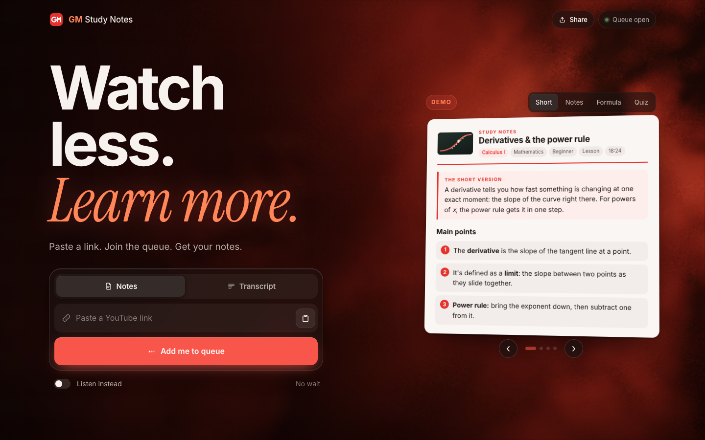
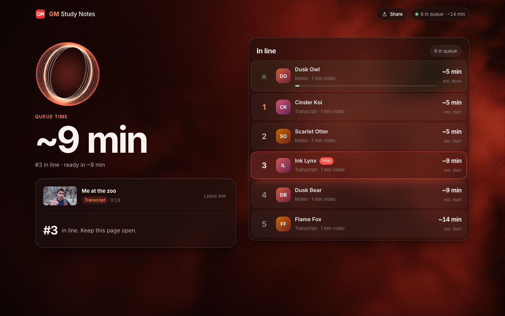
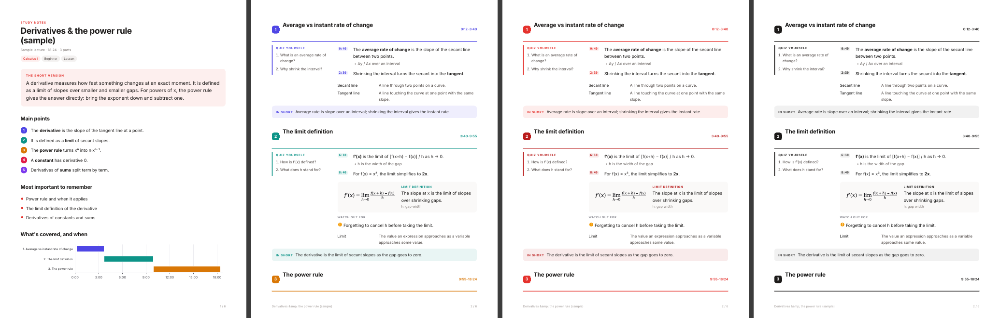

# GM Study Notes

**Watch less. Learn more.** Paste a YouTube link, join the queue, and get college-style study notes as a PDF, or just the transcript.

Live at **[gmstudynotes.com](https://gmstudynotes.com)** · by Gabe Mills



## What it does

- **Transcript or notes.** Uses the video's YouTube subtitles, or listens to the video (Whisper) when there are none.
- **Notes shaped to the subject.** A first pass works out what kind of video it is. Math gets formulas and step-by-step examples, history gets a timeline and cause → effect, essays get claim / evidence tables, law gets case briefs, languages get vocabulary.
- **Cornell layout.** Every part has quiz-yourself questions beside the notes, timestamps that jump to the moment in the video, and a short summary. It ends with a practice quiz, with the answers on their own page.
- **Three PDF styles.** Multi-color, red, or black & white (print-friendly).
- **One at a time.** A fair queue with your place, a live leaderboard, and an estimated wait. When your file is ready you get 3 minutes to download it, then it's deleted. The next person starts as soon as yours is done.
- **Reviews.** People who used it can leave stars and a comment.





## How it works

```
browser ──► Cloudflare Worker (gmstudynotes.com) ──► Cloudflare Tunnel ──► VM (CPU only)
                                                                         ├─ FastAPI app (app.py): queue, tickets, files
                                                                         ├─ youtube-transcript-api / yt-dlp + faster-whisper
                                                                         ├─ Ollama · Qwen3.6-35B-A3B (notes)
                                                                         └─ WeasyPrint + matplotlib (PDF, charts, formulas)
```

- `app.py`: the in-memory queue. A single worker handles one ticket at a time. Results live in a per-ticket folder for 3 minutes and are then deleted. Only reviews and step timings (for wait estimates) are kept.
- `notes.py`: transcript → subject profile → sections cut at natural pauses → structured notes per section → overview and quiz → HTML → PDF in three themes. Numbers and quotes are checked against the transcript before they appear.
- `static/index.html`: the whole site in one page. Three.js volumetric fog, clickable demo notes, queue page with leaderboard, rendering page, reviews.
- `edge/`: the Cloudflare Worker that serves the domain and reaches the VM privately over a VPC service binding.
- `share/`: the template that renders the link-preview image and the Instagram post/story (`node share/render.mjs`).

## Run it locally

Needs Python 3.12+ and [uv](https://docs.astral.sh/uv/).

```sh
./run.sh                     # http://127.0.0.1:5210
```

On a Mac, transcription uses mlx-whisper. Without `OLLAMA_MODEL` set, notes are written by headless Claude Code (`claude -p`). With Ollama running, set `OLLAMA_MODEL` to use a local model instead:

```sh
OLLAMA_MODEL=hf.co/unsloth/Qwen3.6-35B-A3B-GGUF:UD-Q4_K_M ./run.sh
```

PDF export needs WeasyPrint's system libraries (pango).

## Deploy

```sh
GMSH_HOST=<server address> ./deploy.sh
```

This syncs the code, installs ffmpeg, pango, uv and Ollama, pulls the notes model, and runs the app as a systemd service on `127.0.0.1:8080` with the firewall open to SSH only. The public traffic comes in through the Cloudflare Tunnel and Worker (`cd edge && npx wrangler deploy`).

A deploy restarts the app and clears the in-memory queue, so check `/api/queue` is empty first. Page-only changes can be copied to `static/index.html` on the server without a restart.

## Credits

- Loader animation ported from **Orbit Bundle** on [Originkit](https://originkit.dev).
- Fonts: Inter and Instrument Serif (Google Fonts).

AI notes can be wrong. Check anything important against the video.
